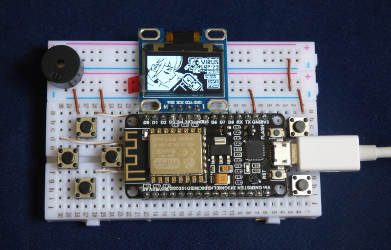
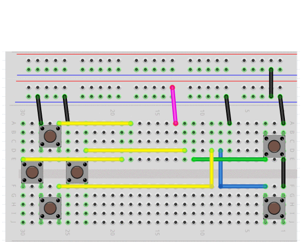

# La biblioteca Arduboy2 funcionando en un ESP8266

Esta es una implementación de la biblioteca Arduboy2 para el ESP8266, los juegos compatibles con Arduboy2 como Castleboy de TeamARG pueden usarla como un reemplazo directo de la biblioteca Arduboy2, otros juegos como Squario o Virus LQP-79 corren con pequeñas modificaciones, pero con futuras versiones podrían correr nativamente.

# Cómo usarla

Simplemente reemplace la biblioteca Arduboy2 en su carpeta de bibliotecas en Arduino Studio con esta versión.

# Hardware

La biblioteca fue probada en un módulo NodeMCU con un microcontrolador ESP-12N.
Requiere un módulo OLED basado en SSD1306, el orden de los pines en el módulo OLED debe ser igual al de la imagen si desea colocarlo en la breadboard directamente a la par del ESP8266.

# Lista de Materiales

Como mencioné antes, la meta es llegar al precio de US$5 por consola, incluyendo envío. Si ordena las partes por Amazon el precio es de unos $30, pero puede comprar partes para 4 consolas en AliExpress por $20, esto sin incluir un circuito cargador de batería, pero con módulo que sostiene 3 baterías AA conectado a los pines Vin y GND es posible jugar sin estar conectado a un cargador USB. Este módulo se puede comprar por pocos centavos en el mismo sitio.

El siguiente archivo contiene un ejemplo de los artículos que necesita comprar, yo NO compré de estos proveedores, ellos no me patrocinan, y no garantizo que las partes funcionen juntas o individualmente.

https://github.com/edgarborja/Arduboy2ESP/blob/master/AliExpressBillOfMateriasl.pdf

# Motivación

Quería construir la consola de juegos portátil más simple (y más barata) que fuera posible, para que un principiante pueda tener la experiencia de armarla, y sentir la emoción que yo sentí cuando comencé a editar gorilla.bas y nibbles.bas en DOS a inicios de los 90's.

Después de buscar un tiempo encontré el fabuloso proyecto Arduboy, y la comunidad que este ha generado, lo que me inspiró a unirme al esfuerzo y contribuir en lo posible.

# Créditos y Documentación

El 99% del trabajo de la biblioteca fue hecho por los contribuyentes a los siguientes repositorios:

https://github.com/Arduboy/Arduboy 

https://github.com/MLXXXp/Arduboy2

https://github.com/harbaum/Arduboy2 

https://github.com/hartmann1301/Arduboy2 hartmann1301 migró la biblioteca a la plataforma ESP8266, en base a su trabajo solo fueron necesarios algunos ajustes.

Por favor lea la documentación extensiva que ellos han generado.

# Contribuciones y Declaración

Las contribuciones a la documentación, al código o a los diagramas electrónicos son bienvenidos. No soy experto en C o en ingenería electrónica; use la biblioteca y los circuitos presentados bajo su propio riesgo.
